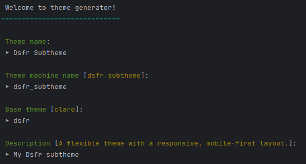

# DSFR

DSFR is a base theme for Drupal, which uses the DSFR library
(FRench Design System, in french: "Design System FRançais" or
"Système de Design de l'État").

See: [official DSFR library documentation](https://www.systeme-de-design.gouv.fr/)

## Table of contents

- [Scope of use](#scope-of-use)
- [Requirements](#requirements)
- [Recommended modules](#recommended-modules)
- [Installation](#installation)
  - [Library installation](#library-installation)
    - [Using Composer (recommended)](#1-the-method-using-composer-recommended)
    - [Manual (not recommended)](#2-the-manual-method-not-recommended)
  - [Install DSFR theme](#install-dsfr-theme)
    - [With drush ](#with-drush)
    - [With Drupal UI](#with-drupals-ui)
  - [Create a subtheme](#create-a-subtheme-highly-recommended)
    - [Manually](#manually)
    - [Generate subtheme with Drush](#generate-subtheme-with-drush)
- [Configuration](#configuration-theme-settings)
- [Troubleshootings](#troubleshooting)
- [About](#about)

## Scope of use

The DSFR library is to be used for digital projects within the
French State: central administrations, their departments, interministerial
delegations, prefectures, embassies and all decentralized services.

More details: [Scope of DSFR use](https://www.systeme-de-design.gouv.fr/comment-utiliser-le-dsfr/perimetre-d-application-du-dsfr) (available only in French)

## Requirements

- Php >= 8.3
- Drupal >= 10.3 || 11

## Recommended modules

* [DSFR Kickstart](https://www.drupal.org/project/dsfr_kickstart)

## Installation

### Library installation

There are 2 methods to install the DSFR library:

1. [The method using Composer (recommended)](#1-the-method-using-composer-recommended)
2. [The manual method (not recommended)](#2-the-manual-method-not-recommended)

#### 1. The method using Composer (recommended)

By using this method, you are utilizing the version of the DSFR library
adapted for the DSFR theme.

1. Add the composer `merge-plugin`:

```bash
composer require wikimedia/composer-merge-plugin
```

2. Add `merge-plugin` to the `extra` attribute in your `composer.json`
   (replace `web` if your Drupal installation directory is different):
    ```json
   {
       "extra": {
           "merge-plugin": {
               "include": [
                    "web/themes/contrib/dsfr/composer.libraries.json"
               ]
           }
       }
   }
    ```
3. Run `composer require drupal/dsfr gouv/dsfr` and check that the DSFR
   library is downloaded to your Drupal `/libraries` directory.

#### 2. The manual method (not recommended)

1. Download the library from https://github.com/GouvernementFR/dsfr
2. Place DSFR library in the root libraries folder (Should be accessible
3. from `/libraries/dsfr`).


### Install DSFR theme

#### With Drush

```bash
drush then dsfr -y && drush cset system.theme default dsfr -y
```

#### With Drupal's UI

Go to "/admin/appearance", then click on "Install and set as default"
for the DSFR theme.

### Create a subtheme (highly recommended)

#### Manually

In the web/themes/custom directory, create a new folder named `dsfr_subtheme`
(or whatever).

Inside this folder, generate a `dsfr_subtheme.info.yml`.
Create a `dsfr_subtheme.theme` file to store your custom hooks.

#### Generate subtheme with Drush

```shell
drush gen theme
```
Fill `dsfr` as base theme.



##### Mandatory content in <dsfr_subtheme>.info.yml

Open `dsfr_subtheme.info.yml`
(located at `web/themes/custom/dsfr_subtheme/dsfr_subtheme.yml`)

You may customize the `name` and `description` values as desired, but all other
fields in the example below are required:

```yml
name: 'Dsfr subtheme'
description: 'My subtheme extending DSFR'
type: theme
base theme: 'dsfr' # defines witch theme you are extending, here dsfr
core_version_requirement: ^10 || ^11

# Specifies all regions available on your page
# You may customize these as needed, but we strongly recommend retaining the default regions if you are unsure of the implications.
regions:
  header_menu: 'Header Top menu (one line)'
  header_search: 'Header Search'
  primary_menu: 'Primary menu'
  notice: 'Notice (important)'
  breadcrumb: 'Breadcrumb'
  sidebar_first: 'Sidebar First'
  tabs: 'Tabs'
  highlighted: 'Highlighted'
  help: 'Help'
  content: 'Content'
  sidebar_second: 'Sidebar Second'
  follow_newsletter: 'Newsletter'
  follow_social: 'Social menu'
  footer_top_1: 'Footer Top 1'
  footer_top_2: 'Footer Top 2'
  footer_top_3: 'Footer Top 3'
  footer_top_4: 'Footer Top 4'
  footer_top_5: 'Footer Top 5'
  footer_top_6: 'Footer Top 6'
  footer: 'Footer body (presentation text, etc.)'
  footer_menu_first: 'Footer First menu (Official institutions)'
  footer_partner: 'Footer Main partner'
  footer_partners: 'Footer Partners'
  footer_menu_last: 'Footer last menu'
  footer_last: 'Footer last line (copyright, etc.)'
```

## Configuration, theme settings

From the `/admin/appearance/settings/<dsfr_subtheme>` page, you can among other
things:

1. Change the institution name
2. Activate mourning mode
3. Add a badge (e.g. “preview” in the color of your choice)
4. Customize logo (in header and footer)
5. Manage margins of main theme areas (header, footer, etc.)
6. Enable support for optional modules RGPD (Tacjs) and newsletter (Simplenews)
7. Select the parts of the library to be loaded

## Troubleshooting

Before posting a support request, check Recent log entries at
`admin/reports/dblog`.

Once you have done this, you can post a support request at module issue queue:
https://www.drupal.org/project/issues/dsfr

When posting a support request, please inform what does the status report say
at `admin/reports/dblog` and if you were able to see any errors in
Recent log entries.

## About

This Drupal theme and the modules that revolve around it have been
developed by the Interacademic Information Systems Service of the
Auvergne-Rhône-Alpes academic region ("Service interacadémique des
systèmes d'information de la région académique
Auvergne-Rhône-Alpes" or SIASI-AURA).

This open-source DSFR-Drupal ecosystem is monitored by the interministerial
digital department (DINUM).
